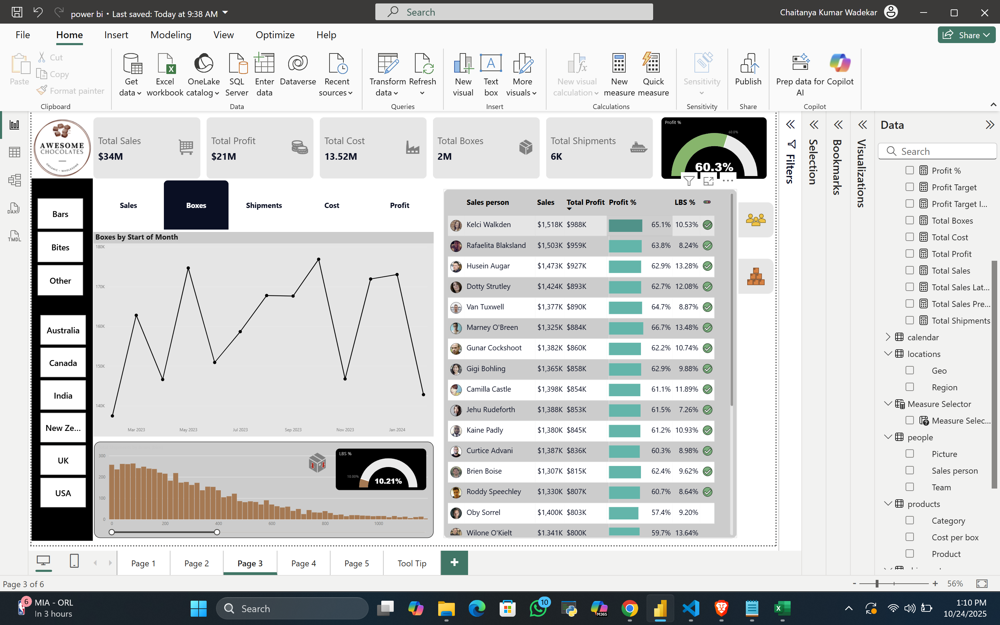

Project Overview

This Power BI dashboard provides an interactive overview of retail sales performance, enabling teams to make data-driven business decisions.
It visualizes trends in revenue, profit, customer segments, and product categories — all in one dynamic view.

See the Full Dashboard Here : https://app.powerbi.com/view?r=eyJrIjoiNjgwYjU3OTUtNjEwZS00OWE2LWFhNWQtOTE5ZDhlZDA3MWMwIiwidCI6IjAzNWRkZWY2LTI0MzMtNDhiNi04NTI2LTcwY2E4MTgxZjc2ZCIsImMiOjN9
___
Objective

Analyze overall sales and profit performance.

Identify top-performing regions, products, and customers.

Discover seasonal sales patterns and growth trends.

Build an intuitive dashboard for business reporting.
___
Tools & Technologies

Power BI – for dashboard design and data visualization.

Excel / CSV Dataset – sales data source.

Power Query – data cleaning and transformation.

DAX (Data Analysis Expressions) – custom calculations and KPIs.
___
Dashboard Highlights

Total Sales, Profit, and Quantity Overview

Sales by Region / State / City

Top-Selling Products and Categories

Monthly and Yearly Sales Trends

Customer Segment Analysis

Profit Margin and Discount Impact
____
Key Insights

Quarter 4 recorded the highest revenue, driven by festive sales.

Top 5 products contributed to nearly 40% of total sales.

The South region showed the strongest month-over-month growth.

Discounts boosted short-term sales but slightly reduced overall margins.
___
Learnings

Creating interactive dashboards using Power BI slicers and filters.

Building calculated columns and measures using DAX.

Structuring dashboards for executive-level reporting.

Gaining experience in data storytelling and visualization design.

___
How to Use

Download or clone the repository.

Open the .pbix file in Power BI Desktop.

Refresh the data source if needed.

Explore the dashboard interactively to view insights and trends.
___
Conclusion

The Retail Sales Dashboard highlights key performance indicators, identifies profitable products, and reveals regional and seasonal patterns.
It demonstrates how Power BI can transform raw sales data into actionable business insights.d Cost.
• Identify top-performing salespersons and high-margin regions.

